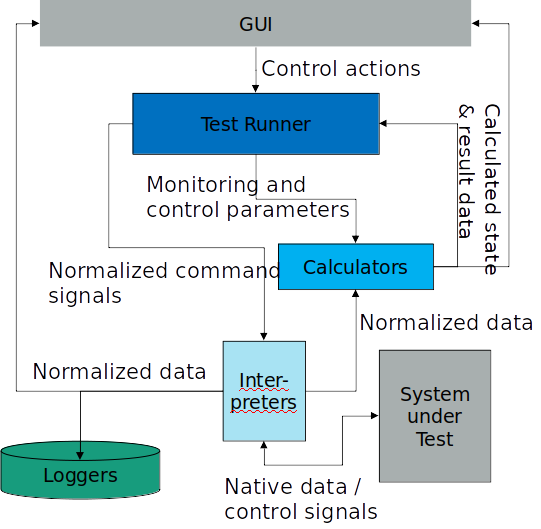

| Title: Testing Tool (from ARAIG project)
| Author: Ruichao Wu <ruichao.wu@ipa.fraunhofer.de>
| Status: Active
| Type: Tool
| Content-Type: text/x-rst
| Created: 28-May-2021

Abstract
========

The goal of this tool is to test the performance of different mobile robots.

System Overview
=======================

System architecture
-------------------

The idea behind the design of this test software is to be able to quickly and easily program a test for ANY ROBOT​.

System Architecture

Basic composable blocks​:

* Calculators – perform live analysis, provide & consume triggers to control test progress, and generate final results​

* Interpreters – translate between abstract test system control signals / commands and measurement data formats to / from formats understood by the System under Test​* 

* Runners – Implement test control flow, each test scenario is represented by one runner, which sets up the test system and executes the test steps​* 

* Loggers – store data for post-mortem analysis​

* GUI – offer an interface for the tester to control test flow, and observe state & results

....

Calculators
----------------

There are two types calculators that are Comparator calculators, and Difference calculators.

Comparator calculators can take data either from two topics or one topic and a rosparam, then give an output in data type "BoolStamp".

.. list-table:: Comparator Calculators
   :widths: 25 50 25 25
   :header-rows: 1

   * - Name
     - Description
     - Inputs
     - Outputs
   * - comp_param_node
     - Compare data from a topic in data type "Float64" with a rosparam
     - data in "Float64" from a topic + rosparam
     - BoolStamp
   * - comp_poses_node
     - Calculate the distance and orientation from two topics in data type "PoseStamped", then compare with thresholds
     - data in "PoseStamped" from two topics
     - BoolStamp
   * - comp_topics_node
     - Compare data from two topics in data type "BoolStamped"
     - data in "BoolStamped" from two topics
     - BoolStamp

.. list-table:: Difference Calculators
   :widths: 25 50 25 25
   :header-rows: 1
  
   * - Name
     - Description
     - Inputs
     - Outputs
   * - diff_pose_temporal
     - Calculate the distance and orientation from a topic in data type "PoseStamped" at different time
     - data in "PoseStamped" from a topic at two timestamps, start signal in "BoolStamped" and stop signal in "BoolStamped"
     - the traveling distance during the time between start signal and stop signal
   * - diff_poses_spatial
     - Calculate the distance and orientation from two topics in data type "PoseStamped"
     - data in "PoseStamped" from two topics
     - the distance and orientation at two points
   * - diff_time
     - Calculate the time difference between two signals
     - data in "BoolStamped" from two topics
     - Float64Stamped
  
....

Interpreters
----------------

There are tree types of interpreters, goal interpreter, velocity interpreter and location interpreter.

* Velocity interpreter: it takes the target speed that is defined as a rosparam. Once it gets a trigger signal, it will publish into a target topic, e.g. "/cmd_vel"

* Goal interpreter: it takes the target goal that is defined as a rosparam. Once it gets a trigger signal, it will publish into a target topic or/and call a navigation action.

* Location interpreter: Marvelmind publish positions of all beacons into one topic. This interpreter parses the data from Marvelmind, and publish positions of all beacons into separate topics. 

....

Creating A Test
================

Composition
----------------

* All the components are built together into a cohesive test within a single launch file
  
* You need to create one launch file per test per robot.
  
* All rosparams per launch file are stored in one .yaml file.
  
* Launch files and yaml files per robot collected into one package.

....

Creating Steps​
----------------

* Step 1: define testing metric, which data needs to be logged.
  
* Step 2: design test flow and create a runner to `control test flow`_.

  .. _control test flow: https://github.com/ipa320/araig_test_stack/blob/master/araig_test_runners/scripts/test_4

* Step 3: implement calculators, interpreters, runner in a launch file, e.g. the `launch file`_ for navigation test.

  .. _launch file: https://github.com/ipa320/araig_robot_packages/blob/master/mobika2_tests/launch/test4.launch

* Step 4: create rosparam in a yaml, e.g. the `rosparam yaml file`_ for navigation test  

  .. _rosparam yaml file: https://github.com/ipa320/araig_robot_packages/blob/master/mobika2_tests/config/test4.yaml

....

Motivation
==========

...

Rationale
=========

.....

Compatibility
=======================

This test tool was developed for a ROS melodic.

.....

Limitations and Improvements
=============================

Known bugs and limitations
----------------------------

- Need to do remapping topics manually which is time-consuming and error-prone.

- Choice of Python as main language: Initial choice was made to help rapid prototyping and easier development. But Rospy has limitations in message handling and is inconsistent 

- Topics as main data flow channels: It helps rapid prototyping and easier development. But stacking multiple calculators leads to propogation delay

.....

Potential improvements
-----------------------

* Use better sensors for localization.
  
* Improve the quality of software as well as the accuracy and consistency of test results can be .

* Port to C++: Roscpp has better baseline performance as well as deterministic message handling, improving consistency

* Use nodelets

* Integrate ROS model toolchain

.....

Reference implementation
========================

Link to code and instructions to install and run the feature or tool

References
==========

.. [#ROS] ROS
   (https://www.ros.org)

.. [#araig_test_stack] araig_test_stack
   (https://github.com/ipa320/araig_test_stack/)

.. [#araig_robot_packages] araig_robot_packages
   (https://github.com/ipa320/araig_robot_packages/)
   
Copyright
=========

This document has been placed in the public domain.

..
   Local Variables:
   mode: indented-text
   indent-tabs-mode: nil
   sentence-end-double-space: t
   fill-column: 70
   coding: utf-8
   End:
